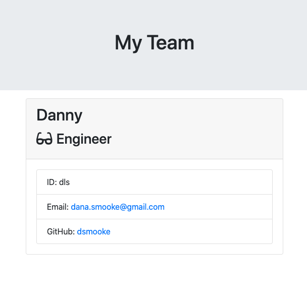

# Start Your Engines 

## Description

This assignment utilizes Node.js and Inquirer.js package to build a Node CLI that takes in information about employees and generates an HTML webpage that displays summaries for each person; it also utilizes the jest.js package to ensure that all unit tests pass.

View the application [here](https://youtu.be/CEHbslpDAQs) 

## Table of Contents

*  [Goals](#Goals)
*  [Instructions](#Instructions)
*  [User Story](#UserStory)
*  [Acceptance Criteria](#AcceptanceCriteria)
*  [Installation](#Installation)
*  [Usage](#Usage)
*  [Bugs](#Bugs)
*  [Questions](#Questions)
*  [License](#License)

## Goals

1. To build a Node CLI that takes in information about employees and generates and HTML webpage that displays summaries for each person. 

2. To ensure that all unit tests pass. 

## Instructions

### User Story
```
As a manager
I want to generate a webpage that displays my team's basic info
so that I have quick access to emails and GitHub profiles. 
```
### Acceptance Criteria
```
GIVEN a command-line application that accepts user input
WHEN I am prompted for information about my application repository
THEN a webpage is generated with the employees' names, email, id, and specific information based on their role with the company
WHEN an employee enters their name
THEN this creates an employee card with their name at the top
WHEN an employee chooses their position at the company from a list of positions
THEN this is added beneath the employee's name and an icon for that role will be added in front of their job title to visualize what they do
WHEN an employee enters their id 
THEN this is added to the information on the card
WHEN an employee enters their GitHub username
THEN this is added to the employee card with a link to their GitHub profile
WHEN an employee enters their email address
THEN this is added to the employee card under the heading 'Email:'
WHEN promted for any additional information based on their role with the company
THEN an employee can enter their additional information
THEN this is displayed at the bottom of their employee card

```

## Installation

Steps required to create  README generator:

1. Create a new repository. 
    * Open GitHub and create new repository.
    * do NOT add a README.md file upon creation (that would defeat the purpose!).
2. Create a new directory to house new repo on your local computer. 
    * Open Terminal (if MacOS), create a new directory using `mkdir project-name`
    * Make sure you are in the *root file* of your local repository before you create any files. 
3. Clone your GitHub repository to your local computer (make sure you are in the root folder of your new directory)
    ```
    git clone ssh-key-from-repository
    ```
4. Create a .gitignore file:
    * type `node_modules` in first line
    * type `.DS_Store` in second line

5. Create a new **package.json** file:
    *  Initialize `npm`: `npm init`. This will be used to set up a new or existing npm package. You can customize the fields, or you can continue to press the enter key until you see `0 vulnerabilities`.
    * This will create a `package.json` file and a `package-lock.json` file. 
    * Install the Inquirer package using: `npm install inquirer`
    * This will create a `node_modules` file. 
    * You are now ready to create your `index.js` file: `touch index.js`

6. Set up Inquirer package within your newly created `index.js` file.
```
const inquirer = require('inquirer');
const fs = require("fs");
const util = require("util");
const { captureRejectionSymbol } = require("events");
const { fileURLToPath } = require('url');

const writeFileAsync = util.promisify(fs.writeFile);
```
7. Copy and paste the code (or fork it) from the `index.js` within this repository.

8. Save file. Run `index.js` file within terminal using `node index.js`

9. If working, answer the prompts by entering your own inputs via the command line. 

10. A file called **team.html** will be created upon completeion and will be found in the `output` folder. 


## Usage

Operating instructions and examples for use.

1. Enter your Name
2. Enter your ID
3. Enter your Email
4. Choose your Role: 
    * Manager (go to step 5)
    * Engineer (go to step 6)
    * Intern (go to step 7)
5. Enter your Office Number
6. Enter your GitHub Username
7. Enter your School 
8. team.html generated in output folder
   



## Bugs

Did not render team page correctly. App.js did not replace placeholders. Role-specific html templates were not added into the main html code. 

  
## Questions

Link to my [GitHub Profile](https://github.com/dsmooke)

You can reach me at dana.smooke@gmail.com if you have any additional questions.


## License

[MIT License](MITLicense.txt)


---
© 2020 Trilogy Education Services, LLC, a 2U, Inc. brand. Confidential and Proprietary. All Rights Reserved.
